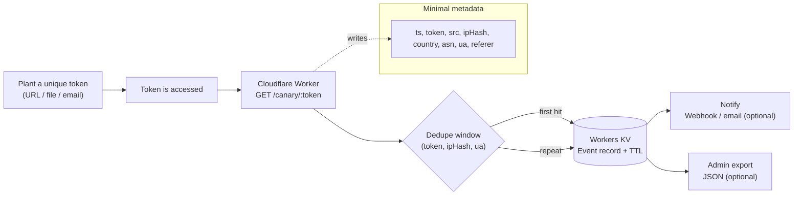

# Kanariya

**Kanariya** is a simple *canary token* service: you place unique URLs/files into specific locations (forms, notes, emails, local files), and if that token is ever accessed, Kanariya records the event and notifies you.

> Scope: **detection + evidence (logs)**. Not a high-interaction honeypot.

## What you can detect

- Leakage / re-sharing of URLs embedded in:
  - Web forms (free text fields)
  - Documents or local files (HTML/shortcut tokens)
  - Emails (click-detection)
- Recon / automated scanning to “obviously sensitive” paths (optional templates)

## Non-goals

- Hosting intentionally vulnerable services
- Active attacker engagement, retaliation, or any offensive behavior
- Capturing payload data beyond minimal request metadata


## How it works

1. Generate a unique token URL:
   - `https://<your-domain>/canary/<token>?src=<source_id>`
2. Place it *only* in one specific location.
3. When accessed, Kanariya:
   - stores an event record (timestamp, token, src, country/ASN/UA, etc.)
   - optionally sends an alert (Webhook / email)


## Quick diagram



## Architecture (recommended)

- **Cloudflare Workers**: event collector endpoint (`/canary/*`)
- **Workers KV**: lightweight event storage + dedupe keys
- **Webhook** (Discord/Slack/etc.): instant notifications
- (Optional) **Admin export endpoint** for JSON export

## MVP spec (v0.1)

This section defines the **minimum** scope for a usable public MVP.

### Goals

- **Plant** unique tokens (URL / file / email) per location.
- **Detect** when a token is accessed.
- **Preserve evidence** (timestamp + minimal metadata) with low false-positive noise.
- **Notify** quickly (Webhook-first).

### Non-goals (MVP)

- High-interaction honeypots (SSH, intentionally vulnerable services)
- Payload capture (request bodies), content inspection, or user tracking
- “Attribution” beyond coarse network fingerprints (country/ASN/UA)

### Public API (MVP)

- `GET /canary/:token?src=<source_id>&v=1`
  - Response: `204 No Content`
  - Behavior:
    - Write event record to storage
    - Notify on first hit per `(token, ipHash, ua)` within a window
    - Apply rate limiting / abuse protection

- `GET /admin/export?token=<token>` (optional, admin-only)
  - Response: JSON array of events for the token
  - Header: `Authorization: Bearer <ADMIN_KEY>`
  - Notes: for MVP, a shared secret is acceptable; later migrate to Cloudflare Access/SSO.
  - If you do not set `ADMIN_KEY`, this endpoint is disabled unless `ALLOW_PUBLIC_EXPORT=1` is set.
  - If `ALLOW_PUBLIC_EXPORT=1`, the admin key is ignored.

### Data model

Per event (recommended minimum):

- `ts` (ISO8601)
- `token`
- `src`
- `ipHash` (HMAC(IP, IP_HMAC_KEY))
- `country` (edge header)
- `asn` (edge header, if available)
- `ua`
- `referer` (when present)

Dedupe / notify key:

- `(token, ipHash, ua)` with TTL (e.g., 30 minutes)

Retention (MVP defaults):

- Events TTL: 30 days
- Dedupe TTL: 30 minutes

### Delivery modes (recommended)

- **Personal / local use**: tokens placed in local files/notes; expect *click/open* to trigger.
- **Enterprise / cloud use**: primary audit comes from the cloud provider; Kanariya acts as an *external-leak evidence* supplement.

### MVP checklist

- [ ] `/canary/*` deployed and reachable from your domain
- [ ] KV bound as `KANARI_KV`
- [ ] `IP_HMAC_KEY` set (no plain IP persistence)
- [ ] Webhook notification tested
- [ ] Dedupe window prevents spam on repeated hits
- [ ] Rate limiting enabled (Worker logic and/or Cloudflare WAF)
- [ ] A small “token planting” playbook exists (URL/file/email examples)

## Server-side configuration (Cloudflare)

This project assumes Cloudflare is the “server side” for the public MVP.

For API token scopes, see `docs/cloudflare_token_permissions.md`.

### 1) DNS / TLS

- Create a DNS record for the service hostname (example):
  - `kanariya.toppymicros.com` (proxied = **ON**)
- Ensure Universal SSL is enabled for the zone.
- (Recommended) Set SSL/TLS mode to **Full (strict)**.

### 2) Worker route binding

Bind the Worker to your hostname and paths (example):

- Route: `kanariya.toppymicros.com/canary/*`
- (Optional admin) Route: `kanariya.toppymicros.com/admin/*`
  - Omit this route if you do not need `/admin/export`.

> You can also attach the Worker to the whole host and switch by path in code.

### 3) Storage: Workers KV namespaces

Create and bind the following KV namespaces:

- `KANARI_KV` (required)
  - Stores event records and dedupe keys.

Recommended TTL defaults (tune as needed):

- Events: 30 days
- Dedupe keys: 30 minutes

### 4) Environment variables / secrets (required)

Configure the following on the Worker:

- `IP_HMAC_KEY` (**secret**, required)
  - Used to store `ipHash = HMAC(IP, IP_HMAC_KEY)` instead of plain IP.
- `ADMIN_KEY` (**secret**, optional)
  - Required only if `/admin/export` is enabled. If unset, `/admin/export` returns 403.
- `ALLOW_PUBLIC_EXPORT` (non-secret, optional)
  - Set to `1` to allow `/admin/export` without `ADMIN_KEY` (overrides admin key). Not recommended for public use.

Optional:

- `WEBHOOK_URL` (**secret**, optional)
  - Webhook destination for notifications.
- `MAIL_FROM` (optional)
  - Sender email address for MailChannels.
- `MAIL_TO` (optional)
  - Comma-separated recipient list for MailChannels.
- `MAIL_FROM_NAME` (optional)
  - Sender display name (default: Kanariya).
- `MAIL_SUBJECT_PREFIX` (optional)
  - Subject prefix (default: Kanariya alert).
- `EVENT_TTL_SECONDS` (non-secret, optional)
  - Default: 2592000 (30 days).
- `DEDUPE_TTL_SECONDS` (non-secret, optional)
  - Default: 1800 (30 minutes).
- `EXPORT_MAX_ITEMS` (non-secret, optional)
  - Default: 1000 (admin export cap).
- `RATE_LIMIT_WINDOW_SECONDS` (non-secret, optional)
  - Default: 60 (per-IP window, set 0 to disable).
- `RATE_LIMIT_MAX` (non-secret, optional)
  - Default: 60 (max hits per window, set 0 to disable).

### 5) Cloudflare security controls (strongly recommended)

- **Rate limiting**
  - Apply a rate limit for `/canary/*` to mitigate abuse.
  - Start conservative, e.g. per-IP bursts allowed but sustained floods blocked.
- **WAF rule**
  - Block obvious bot floods and suspicious user agents.
  - Optionally challenge traffic to `/admin/*`.
- **Bot / Super Bot Fight Mode** (if available)
  - Useful for public exposure.

### 6) Observability / logs

- Decide what you retain:
  - Keep only minimal request metadata in KV (as documented).
  - Avoid logging request bodies.
- For debugging:
  - Use Workers logs during development.
  - Consider sampling or short retention if you enable additional analytics.

### 7) Admin endpoint protection (if enabled)

Minimum (MVP):

- Require `Authorization: Bearer <ADMIN_KEY>` header.
  - To disable admin export entirely, remove the `/admin/*` route and omit `ADMIN_KEY`.

Recommended (post-MVP):

- Put `/admin/*` behind **Cloudflare Access** (SSO / device posture).

### 8) Suggested `wrangler.toml` skeleton (example)

```toml
name = "kanariya"
main = "src/worker.js"
compatibility_date = "2026-01-12"

# Route binding
routes = [
  { pattern = "kanariya.toppymicros.com/canary/*", zone_name = "toppymicros.com" },
  # Optional admin export
  { pattern = "kanariya.toppymicros.com/admin/*", zone_name = "toppymicros.com" }
]

kv_namespaces = [
  { binding = "KANARI_KV", id = "<KV_NAMESPACE_ID>" }
]

[vars]
# Non-secret vars can go here (optional)
# NOTIFY_DEDUPE_TTL = "1800"
```

Secrets:

```bash
wrangler secret put IP_HMAC_KEY
wrangler secret put ADMIN_KEY   # optional (only if /admin/export enabled)
wrangler secret put WEBHOOK_URL   # optional
```

## Quick start (Cloudflare Workers + KV)

### Prerequisites

- Cloudflare account
- Node.js (LTS)
- Wrangler CLI

### Setup

1. Create a KV namespace (for events) and bind it to your Worker as `KANARI_KV`.
2. Configure secrets:
   - `ADMIN_KEY`: export endpoint guard (optional)
   - `IP_HMAC_KEY`: HMAC secret used to hash IPs (PII minimization)
   - `WEBHOOK_URL` (optional): Discord/Slack webhook
3. Deploy the Worker.

### Minimal configuration (example)

Create bindings/secrets via Wrangler (example names):

```bash
wrangler kv namespace create "KANARI_KV"
wrangler kv namespace list
wrangler secret put ADMIN_KEY   # optional
wrangler secret put IP_HMAC_KEY
wrangler secret put WEBHOOK_URL   # optional
```

> Note: This repo may include a ready-to-deploy Worker template (planned). If you already have your Worker code elsewhere, the binding names above match the intended defaults.

## GitHub Pages UI (optional)

The token generator UI is available at `docs/index.html` so you can host it on GitHub Pages.
It includes a basic admin export viewer (Authorization header required). If admin export is disabled, it will return 403.

1. GitHub repo settings → Pages
2. Source: `Deploy from a branch`
3. Branch: `main`, Folder: `/docs`

Your UI will be served from the GitHub Pages URL, while the API continues to run on Cloudflare Workers.

## Token formats

### 1) URL token (recommended)

```text
https://<your-domain>/canary/<random_token>?src=form_invoice_2026q1&v=1
```

- `random_token`: long URL-safe random (recommend ≥ 16 bytes)
- `src`: location identifier (“where you planted it”)

### 2) File token (opens = fires)

Create an HTML file like `Invoices_2026Q1.html` containing:

```html
<!doctype html>
<meta charset="utf-8"/>
<title>Invoices 2026Q1</title>
/canary/<token>?src=file_invoices_2026q1" />
```

- When someone opens it in a browser, the image request triggers the canary.

### 3) Email token (click-detection)

Put a token URL in the email body:

```text
https://<your-domain>/canary/<token>?src=mail_personal_test
```

**Tip:** Avoid image beacons at first.
Some clients/gateways prefetch/proxy images and cause false positives.

## Event fields (MVP)

Stored per hit (recommended minimal set):

- `ts` (ISO8601)
- `token`
- `src`
- `ipHash` (HMAC of IP, not plain IP)
- `country` (from CDN headers)
- `asn` (if available)
- `ua` (User-Agent)
- `referer` (when present)

## Notifications

Recommended behavior:

- Notify only on **first hit** per `(token, ipHash, ua)` within a time window
- Rate-limit aggressively to prevent spam

MailChannels email (optional):

- Requires sender domain verification with MailChannels (see their docs).
- Set `MAIL_FROM` and `MAIL_TO` to enable email alerts.

## Admin export (optional)

Provide a simple endpoint like:

```text
GET /admin/export?token=<token>

Authorization: Bearer <ADMIN_KEY>
```

Return JSON array of events for the token.
If you do not need admin export, remove the `/admin/*` route and omit `ADMIN_KEY`.

## Security & privacy

- **PII minimization**: store `ipHash` (HMAC) instead of plain IP.
- Do not store request bodies.
- Prefer `204 No Content` responses to reveal nothing.
- If publishing publicly:
  - add per-IP rate limits
  - add abuse protections (WAF / bot fight mode)

## Minimal abuse policy (MVP)

Kanariya is for **defensive, consent-based** monitoring only. Do not use it to:

- Monitor systems or data you do not own or have explicit permission to test.
- Send canary links to targets without authorization.
- Collect or store sensitive payloads or personal data beyond the documented minimal fields.

If you deploy publicly, publish a contact channel for abuse reports and respond promptly.

## Limitations

- DNS/HTTP telemetry can’t tell you “what data” was leaked—only that a token was accessed.
- Email environments may trigger false positives (prefetch/proxy).
- If an attacker exfiltrates files but never opens them, file tokens may not fire.

## Roadmap

- [ ] Public MVP hardening: rate limits, dedupe defaults, and a minimal abuse policy
- [ ] Worker template + `wrangler.toml` scaffolding
- [ ] Token generator UI (static)
- [ ] CSV bulk token generation
- [ ] Simple dashboard
- [ ] Evidence report (ASN/country/time clustering, proxy-like labeling)

## Contributing

PRs are welcome. Keep the project focused on **detection + evidence**.

## License

Apache License 2.0 (Apache-2.0)

Copyright (c) 2026 ToppyMicroServices OÜ

> Add a `LICENSE` file in the repo root with the full Apache-2.0 text.
