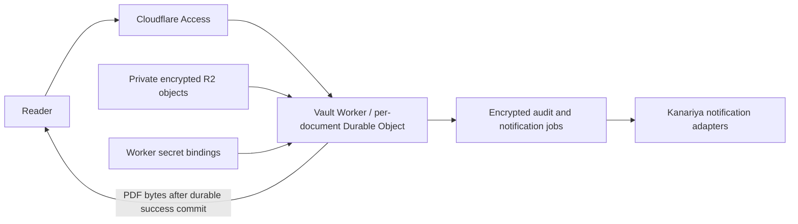

# Kanariya Vault

A document service with per-document Access or shared-password authentication. It decrypts on the server, commits an encrypted audit record and notification job, then returns the document bytes. There is no client key endpoint. This is a separate Worker; the existing public canary endpoint is not an authorization or acknowledgement mechanism.

## Two reader modes; owner administration always uses Access

The encrypted version-2 document policy selects exactly one `authMode`:

- `access` is the default, including historical policies with no mode field. It requires a verified Cloudflare Access JWT and an explicitly granted subject. Existing `/#<uuid>` links and `/v1/documents/<uuid>/open` remain supported.
- `password` requires a 12–256 UTF-8-byte shared password and an empty `subjects` array. Its reader link is `/p/<uuid>`. It does not require the reader to obtain an Access JWT. It is **disabled by default** with `PASSWORD_READER_ENABLED="0"`; only the exact string `"1"` enables these reader routes.

There is no fallback between modes. A password session cannot open an Access document, and an Access JWT cannot substitute for the shared password. Owner status, revocation and notification repair stay under `/v1/documents/...` and always require the verified owner Access subject. Shared access is audited as `shared-password`, not as an identified individual.

The source-only release preserves the existing deployment configuration. The origin, Access configuration, owner/secrets, exact dummy UUID/ciphertext digest and provider setup must remain valid. The dummy-only gate is unchanged; real CVs remain excluded. Before any new installation, review the Access application routing: `/` and `/v1/*` must remain protected, while only the separate `/p/*` reader surface may be reachable without a reader JWT. Do not turn off Access for the whole hostname. Use a dedicated origin without an existing service worker or cache rules that override the no-store headers. No Access policy, secret, bucket or live document is provisioned by these scripts or by the main repository workflow.

For offline preparation, the trusted stdin object accepted by `seal-document.mjs` adds `authMode`. Password mode uses `authMode:"password"`, `subjects:[]`, and `password`; Access mode uses `authMode:"access"` (or omission), `subjects`, and no password. Do not put credentials in command arguments, shell history, URLs, logs or checked-in files. Use the existing trusted secret-store bridge. Prefer a long randomly generated password or passphrase; communicate it separately from the document link.

Only a salted scrypt verifier is stored inside the encrypted policy. The fixed [OWASP scrypt profile](https://cheatsheetseries.owasp.org/cheatsheets/Password_Storage_Cheat_Sheet.html#scrypt) is N=16384, r=8, p=5, with a 32-byte salt and 32-byte output. Native [`node:crypto`](https://developers.cloudflare.com/workers/runtime-apis/nodejs/crypto/) needs `nodejs_compat` in the Vault configuration. Provisioning validates the exact profile and rejects malformed verifiers or mixed-mode policies. Worker/operator key access remains a trust boundary; this is not end-to-end encryption.

Password unlocks issue opaque 256-bit sessions lasting at most five minutes, capped by the document expiry. The browser receives a Secure, HttpOnly, SameSite=Strict cookie scoped to `/p/<uuid>/`; only its hash, current ciphertext digest and expiry are kept in the encrypted per-document Durable Object journal. Sessions do not slide or renew automatically. Logout removes the current session; owner revocation removes all sessions and remains irreversible. Changing the pinned record invalidates existing sessions. Use a newly reviewed dummy UUID when rotating a document or changing its mode rather than trying to undo revocation.

Public request bodies are limited to 2 KiB and five seconds and are read outside the per-document state queue. Password routes use a separate encrypted admission budget before R2 reads or the password KDF: ten attempts per source in five minutes, including successful attempts, and 120 attempts per document in that window. Other cookie-bearing password requests allow 30 per source and 600 per document per minute. Parallel requests and object restarts do not reset these budgets. At most 32 live sessions are allowed. Cookie-less logout only validates the request and clears the cookie; it does not access keys or storage. Invalid session cookies cannot reach R2 or document decryption. Password R2 reads also run outside the owner mutation queue.

Source buckets use a document-scoped HMAC of the edge-provided `CF-Connecting-IP`, stored only inside encrypted state. Raw IPs and User-Agent are not retained or used as alternative identities. Equivalent IPv6 forms share a bucket; missing or invalid edge source fails closed. Users behind the same NAT share limits, and multiple sources can still exhaust the document-wide backstop. Cloudflare's [same-zone Worker and cross-zone header behavior](https://developers.cloudflare.com/fundamentals/reference/http-headers/#cf-connecting-ip) also applies; these source limits do not identify a person or guarantee protection against distributed denial of service. Production saturation and CPU costs remain unmeasured.

Both modes recheck the deadline immediately before returning plaintext. The viewer also clears canvases at the document deadline; password mode clears at session expiry and checks current authorization every 15 seconds while showing a document. Hidden pages, logout, close and navigation cancel pending display work. These controls cannot retract bytes already delivered, screenshots, saved files or an in-flight network response. A web password is separate from PDF-file encryption; the viewer does not unlock a separately password-encrypted PDF.

### Document and session deadlines

The owner sets `expiresAt` (epoch milliseconds) in the trusted offline preparation
input when sealing the document. It is the document's last permitted acquisition
time, enforced by the server on every open, including the viewer's Save action.
The reader displays this deadline in Japan time. Password mode also displays the
current session deadline; that session lasts at most five minutes, does not renew
automatically, and may end before the document deadline. The reader can authenticate
again while the document remains valid.

The owner console at `/v1/admin` manages the current pinned dummy PDF, its reader
link, viewing deadline and irreversible revocation. It requires the existing
verified owner Access subject; a reader's Access login or password session cannot
use it. It does not open the PDF or send a notification when the page loads.

The owner can shorten the deadline, or restore it up to the original sealed
policy's expiry. This override is bound to the pinned ciphertext digest and saved
only in the encrypted Durable Object journal. Existing password sessions are
shortened as well; restoring the document deadline does not extend those sessions.
The API rejects stale edits, revoked documents and extensions past the sealed
expiry. Both reader modes enforce the effective deadline on new acquisitions.

The console can now register private PDF candidates, record disclosure contacts,
and read acquisition logs. Registering a candidate does not change the shared PDF.
Activating a replacement or extending beyond the sealed policy still requires a
separately reviewed record, private R2 object, UUID and exact ciphertext digest.
The dummy-only gate remains in place, and real CVs are not admitted for viewing.

### Private PDF candidates, disclosure contacts and owner logs

The owner's closed panels load their data only when opened. They use the same
verified owner Access subject as deadline management. Reader identities and
password sessions cannot use these APIs. Merely reading them does not decrypt
the shared PDF, enqueue notifications, or change access permissions.

Private registration accepts one PDF of at most 1 MiB and a future Japan-time
deadline. It encrypts the PDF, filename and policy with the existing independent
document-key wrapping scheme; registration metadata is encrypted under the audit
key. R2 stores immutable objects under `staging/`, separate from the active record.
The encrypted policy grants only the authenticated owner subject. A private
candidate ID cannot be opened through either public reader mode.

The registry reserves an encrypted durable slot before any R2 write, and limits
completed and incomplete registrations together to 20 slots. A failed or uncertain
write retains its slot and private status across restarts. The UI confirms a
registration by reading its ID back and does not automatically resend an uncertain
upload. Cleanup, retry and activation of incomplete candidates are not yet exposed
by the console. Registration checks the PDF header and size; it does not establish
structural validity, accessibility or the presence of a recipient watermark.
Review the final PDF using the preparation checks above before any activation.

Disclosure contacts are an encrypted list of up to 50 email addresses, with stale
edits rejected. They are records of intended recipients, **not email authentication
or an access allowlist**. They neither change the Access policy nor identify a
shared-password reader. Effective email-only access needs a separately approved
reader authentication configuration; administration remains owner Access only.

Owner logs show acquisition attempts from the current dummy document over the
last 30 days, including the outcome and notification queue/provider acceptance
state. Each page contains at most 50 events and uses a short-lived encrypted
cursor. The endpoint reads encrypted active and archived audit entries without
fetching or decrypting the PDF. Access entries retain their verified subject ID;
shared-password entries remain unidentified. Provider acceptance does not prove
mailbox receipt, and a decryption event does not prove the document was read.
The current event schema does not distinguish display from download.

Revocation stops future acquisitions in both modes. Password mode also polls
authorization while displaying a document; Access mode does not poll revocation
after display begins. Neither mode can recall content already received or saved.
The visible recipient name identifies the intended recipient of a copy, rather
than proving the identity of the person who holds the shared password.

Password reader API (all responses, including errors, are `no-store`; no cross-origin CORS):

| Path | Method | Effect |
| --- | --- | --- |
| `/p/<uuid>` | GET | Empty password reader shell; no document bytes |
| `/p/<uuid>/session` | POST | Same-origin JSON `{ "password": "..." }`; checks the verifier and issues a short cookie |
| `/p/<uuid>/session` | DELETE | Same-origin empty JSON `{}`; removes current session and clears cookie |
| `/p/<uuid>/status` | GET | Requires the current session; returns document/session deadlines only |
| `/p/<uuid>/open` | POST | Same-origin fresh request UUID plus current session; audited PDF release |

PDF release is POST-only. GET, HEAD, Range headers and conditional requests do not provide alternate content endpoints. Renderer assets at `/p/assets/*` contain only the pinned PDF.js library and empty viewer UI; they do not carry passwords, document bytes or owner data.

Notification sends now take place outside the document's serialized request queue. A short encrypted durable lease is committed before each send and its result is committed afterward; owner status/revoke remain responsive during a slow provider call. Retries remain at-least-once and retain the same event idempotency key; a process crash can still cause duplicate provider acceptance.

**Historical snapshot (2026-10-07):** the native Cloudflare notification candidate was activated as private version `f9921a18-5a91-4af1-a97a-99a31b3208a6`, with source SHA-256 `dc71446d70cd91969e57b478d94b79f9dd184080ba01bbfb354e3919f02568ec` verified by readback. The owner confirmed both local dummy-test notifications in Proton's Spam folder. Inbox placement remained unverified. Activation preserved the original nine bindings, keys, runtime/settings, disabled public endpoints and root Proton mail DNS. At that point origin, Access, owner subject and dummy pins were unconfigured and production viewing was inactive. The later dummy rollout configured these values; this snapshot is not a description of the current deployment. No real CV access, Proton mailbox access, paid upgrade or additional notification send occurred during that activation.

**Previous deployment (2026-10-06):** the local canvas viewer displayed the reviewed dummy PDF in the browser that previously showed an empty native PDF frame. The exact tested bundle was deployed to the private Vault as version `49f347bc-7397-499f-9a80-3e6135ce4657`, with source hash `af59ef55d3164040909bca7a9c250b46d2d9df5aa3e8bd37ef2383bbf1bdd773` verified by readback. Two new independent 256-bit dummy-service keys were backed up separately in macOS Keychain, verified there, then added as `VAULT_WRAP_KEY` and `VAULT_AUDIT_KEY` secrets. Source deployment inherited all nine existing bindings and preserved the runtime, migration tag, settings and disabled public endpoints. Notification settings and the owner subject were absent. Origin, Access and dummy-pin values were invalid placeholders. Existing Drive archives and CV keys were unchanged.

**Dummy-only rollout:** the service admits only one explicitly reviewed synthetic encrypted record. `DUMMY_DOCUMENT_ID` pins its UUID and `DUMMY_RECORD_SHA256` pins the SHA-256 of its exact uploaded bytes. Missing or malformed pins disable requests. A different document ID or changed object is rejected before any document key is imported, policy is decrypted, document audit entry is written, or notification is queued. Password admission/session checks may use the audit key and update the separate admission budget before fetching that object. There is no unrestricted live-mode switch and no automatic activation of real CVs. Set pins only after checking the source fixture hash and its dummy-content QA report: a digest does not classify a document's contents. An administrator who changes the pins can select another record; this guard prevents accidental admission and object replacement, not administrator compromise.

## Request flow



The Worker first limits document routes to the pinned dummy UUID. Access readers and all owner operations then verify the Access JWT signature, issuer, audience, expiry and subject using `jose`; explicitly enabled password readers follow the isolated session flow above. It ignores the unsigned email header. On each open, the exact R2 bytes must match the pinned digest before the document wrapping key is imported or the encrypted policy is read. Access-mode policies grant explicit subjects and an expiry time; a valid Access login alone does not grant document access. The browser uses a same-origin POST with a fresh request UUID, so an ordinary link preview does not decrypt the document.

Before document decryption, the Durable Object commits an encrypted attempt, replay guard and delayed notification job. After successful decryption it commits the success outcome before returning PDF bytes. If this second commit fails, no PDF is returned; the attempt remains and its job can report `unknown`. A decryption failure reports `failed`. A lost HTTP response after the success commit does not prove the recipient received or read the document.

Each distinct accepted open has its own server-generated event ID. Reusing a request UUID is rejected for 30 days, including after an object restart. The ordinary canary's notification deduplication does not apply. Notifications contain only a random event ID and fixed outcome, without document IDs, names, CV content, keys, user subjects, IPs or referers. Delivery adapters are shared with Kanariya; email, Slack, Discord and generic HTTPS webhooks are supported.

Completed audit events and accepted notification jobs move from the active journal into separate encrypted records; replay guards move with their original 30-day deadlines. Cleanup uses a bounded expiry index. This also migrates legacy saturated journals without deleting unexpired evidence. New opens allow ten outstanding notification jobs per reader bucket, ten acquisitions per minute and 100 per UTC day. Access mode buckets use verified subjects; password mode uses source HMACs rather than resettable sessions. The global pending queue remains capped at 100 jobs. The historical event count no longer blocks new opens, while audit-write failure and unresolved notification failure still prevent release.

## Notification guarantees

`200` means the service decrypted the document and committed the audit + job. It does **not** mean an email reached an inbox or was read. A missing or malformed notification configuration, storage failure, a full pending queue, or an unresolved terminal notification failure prevents new content releases. Per-reader limits reject that bucket's acquisitions without filling the global queue.

The viewer reports queue registration, not notification delivery. Email preflight rejects obvious address-format errors before document storage or keys are accessed. It does not verify DNS, provider credentials or inbox delivery.

Alarms retry transient provider failures. A 2xx provider response records `accepted`; this is not a delivery receipt. After a terminal failure, the owner must explicitly repair/retry the notification before new opens. Alarms are at least once, so a crash after provider acceptance can cause duplicate messages. A 10-second unresolved attempt reports `unknown`, never a fabricated success.

## Privacy and keys

- Documents use an independent random AES-256-GCM data key. The data key and access policy are encrypted under `VAULT_WRAP_KEY` with separate authenticated contexts. Only the encrypted record is stored in R2.
- Audit records, access subjects, request history and outbox details are encrypted with a separate `VAULT_AUDIT_KEY` before every Durable Object write. The wrapping and audit key values must differ. Only ciphertext, object IDs and alarm scheduling metadata persist outside that envelope.
- Server keys and notification credentials belong in Worker secret bindings, not Wrangler vars, source control, uploaded objects or browser JavaScript. Sender and recipient addresses also belong in secret bindings. Binding separation is not an HSM or protection against a compromised Cloudflare administrator/Worker.
- No code path returns a decryption key. There is no public provisioning API. Responses set `no-store`; the viewer passes the PDF bytes in memory to a same-origin PDF.js worker and renders pages on canvases. Closing, hiding or leaving the page, changing the link, or reaching the enforced deadline cancels rendering, destroys the loading task and clears canvas dimensions/references. There is no localStorage, sessionStorage, IndexedDB or service worker. Destroying browser objects is not a guarantee of immediate physical memory erasure.
- Closing the viewer, leaving the page or changing the document link invalidates pending responses, so a late response cannot redisplay the old document. Canceling the browser request cannot undo a server-side decryption or notification job already committed.
- The viewer intentionally displays plaintext to an authorized reader. These cache instructions do not prevent screenshots, downloads, OS swap, browser crash recovery, malicious extensions or retention by a permitted recipient. Browser disk-cache behavior has not been independently verified. A saved plaintext copy can be read again without this service.
- Worker observability is disabled in the template; application errors use fixed codes. Cloudflare Access, account audit, billing, backup and infrastructure logs are a separate boundary. Review their actual retention and content before importing personal data. This change does not claim provider-wide absence of identity metadata.

The wrapping key authorizes server-side decryption of the document key. The encrypted access policy must be read to check the grant; the PDF is not decrypted until authorization and the durable attempt commit succeed. The trusted service/operator can decrypt, so service compromise remains a material risk.

## Recipient names and saved copies

The owner can prepare a separate PDF for each disclosure recipient. Supply
`recipientName` and `watermarkFontPath` to the owner-side `seal-document.mjs`
input. The tool adds `開示先: <name>` in translucent gray on every page before
encryption. Original text remains selectable. It passes only PDF bytes, the
recipient name and font path to the local Python helper; keys and passwords are
not passed to that process. Intermediate plaintext PDFs are kept in memory.

The helper needs Python with `pypdf` and `reportlab`, plus a locally licensed
TrueType font covering the recipient's characters. Set
`KANARIYA_WATERMARK_PYTHON` to choose the Python executable. Missing fonts,
unsupported characters, signed/encrypted PDFs and unsupported interactive
content fail preparation instead of silently producing an unmarked copy.
Check the final PDF's structure and render every page before changing the
production dummy pin. No existing stored document is automatically replaced.

The tested Python versions are pinned in `requirements-watermark.txt`; these
are owner-side dependencies and are not included in the Worker. Run their
separate regression checks with a Japanese-capable font:

```sh
python3 -m pip install -r requirements-watermark.txt
KANARIYA_TEST_FONT=/absolute/path/to/font.ttf python3 -B -m unittest discover -s tests -p watermark_pdf_test.py
```

The preparation limit is 20 pages and 1 MiB after stamping. Inspect the actual
final PDF with qpdf and Ghostscript, and render every page with independent PDF
engines; passing the unit tests alone does not establish final-document quality.

The name is stored inside the encrypted policy. The authenticated response
suggests `CV_<recipientName>.pdf`; the viewer shows **PDFを保存** only after a
named document has opened. Saving makes a fresh authenticated `POST /open`,
with the same expiry, revocation, replay, audit and notification checks as
viewing. Closing or hiding the page cancels a pending browser save. Legacy
unnamed records remain viewable and do not expose this save button.

Each stock-viewer display or Save request creates a decryption event, but the
current audit/notification schema does not distinguish display from download.
An authorized client can also retain the initial PDF response without invoking
Save, so the service cannot guarantee an additional event for every saved copy.

`sealDocument()` is a low-level trusted preparation function: its caller must
provide the already marked PDF. The owner CLI performs the marking itself.
The service returns those exact encrypted-at-rest document bytes after
decryption; it does not add a browser-only watermark or alter PDFs on the Worker.

A name identifies the intended recipient of that copy. Shared passwords do not
verify an individual reader's identity. Names and watermarks can be removed,
and saved copies can be redistributed or opened without notifying this service.

## Configuration and rollout

`wrangler.toml` deliberately has no production route and disables `workers.dev` and preview URLs. `wrangler.production.toml` identifies the provisioned account and private bucket, but keeps public endpoints disabled and invalid origin, Access and dummy-pin placeholders. Neither configuration activates document viewing. The deployment was built with Wrangler 4.136.3. Remote observability status was not established by the settings readback; the local configuration disables it.

Both checked-in Vault configurations are templates with placeholders; do not use them to overwrite an existing deployment. For a source update, first read the live Worker metadata and inherit all bindings, including secret bindings and the `send_email` sender/recipient restrictions. Preserve the live compatibility date, runtime settings and migrations. If `nodejs_compat` is absent, add that flag for this source's native `node:crypto` support; leave other runtime values unchanged. Read back the uploaded version to confirm these settings before activation. Any public route or Access scope change requires a separate review and approval.

For the existing dummy installation, run the manual **Deploy Vault source** GitHub workflow on the reviewed main commit. It uses the existing `CF_API_TOKEN` and `CF_ACCOUNT_ID`, tests a frozen bundle, and inherits the live bindings without reading their secret values. It verifies source, settings, runtime, the dummy bucket binding and Worker endpoints before and after activation. A configuration mismatch stops the release; an uncertain upload or activation is not automatically retried or rolled back. The ordinary main workflow still deploys only the canary Worker.

This source-only release makes no R2 API calls and changes no R2 configuration or
objects. It does not re-establish the bucket's current public-domain settings; the
report marks that separate audit as unverified. The previous R2 settings check
returned an authorization error before any update. Account-wide R2 read permission
is not required for the Worker source upload and is not added by this workflow.
Keep the existing private-bucket configuration; any change to its public exposure
requires a separate review.

After the new code archives audit/replay records, older code cannot read those records. Code predating the owner deadline API also ignores a saved deadline override and can reopen access until the original sealed expiry. Do not automatically roll back to either version; recovery must retain replay enforcement, archived evidence and the effective document deadline.

1. Select the target account, Access-protected HTTPS origin and private R2 bucket. Confirm the deployment scope and current provider costs. Keep the existing canary Worker and its routes separate.
2. Set `PUBLIC_ORIGIN`, `ACCESS_ISSUER` and `ACCESS_AUDIENCE` to the actual Access application. Pin the same issuer/audience in the deployed Worker. Set the owner subject as secret `VAULT_OWNER_SUB` and review each reader's subject-based grant.
3. For a new isolated installation only, provision independent 256-bit base64 values for `VAULT_WRAP_KEY` and `VAULT_AUDIT_KEY` in the service's secret bindings. An existing deployment must retain its current keys. Keep recoverable protected backups outside the bucket. Do not rotate these by simply replacing the current values: existing encrypted objects/journals would become unreadable without a migration.
4. Configure the notification provider after verifying the sender domain and recipient. Cloudflare uses `MAIL_PROVIDER=cloudflare`, `MAIL_FROM` and `MAIL_TO` secrets, and a `NOTIFY_EMAIL` send binding restricted to the verified recipient. It needs no MailChannels API key. MailChannels remains the default when `MAIL_PROVIDER` is absent; that path needs `MAILCHANNELS_API_KEY`, `MAIL_FROM`, `MAIL_TO` and optionally `MAIL_FROM_NAME`. No real recipient or API key is in the template.
5. Prepare only the reviewed dummy PDF. For an existing deployment, seal it with the current `VAULT_WRAP_KEY` through the trusted secret-store bridge; fresh service test keys belong only to a new isolated installation. Set `DUMMY_DOCUMENT_ID` to the sealed record UUID and `DUMMY_RECORD_SHA256` to the SHA-256 of the exact encrypted file uploaded to the private bucket. Hash the encrypted record, not the original PDF. Do not reformat JSON after hashing; whitespace changes also invalidate the pin. Invalid placeholder defaults deny all requests.
6. Deploy and verify with that dummy: signature rejection, unauthorized document rejection, changed-record rejection, encrypted persistence, actual alert delivery, revocation, provider outage/recovery and viewer cache behavior. A replacement dummy requires an explicit pin update; there is no acceptance of arbitrary bucket contents.
7. Keep real CVs and their Mac keys outside this deployment. Passing the dummy checks does not activate or migrate them. Any later real-CV rollout requires a separate explicit decision and revised admission policy after target/permissions/logging/recovery checks; this version provides no live-mode bypass.

Drive remains an encrypted archive. This service uses a private R2 working copy to avoid embedding a personal Drive session or long-lived Google bearer token. Both copies remain ciphertext. The current `CVVAULT1` archive is deliberately not treated as a server record: version 2 uses a fresh data key, an encrypted access policy, and a wrapped key. No real archive has been converted in this change.

`scripts/seal-document.mjs` is an owner-side preparation tool. Its bounded stdin JSON contains `sourcePath`, `outputDirectory`, `subjects`, `expiresAt` (epoch milliseconds), and `wrappingKey`. It opens the source without following a final symlink, writes only a new encrypted `UUID.sealed.json` with mode 0600, and prints only the new ID/ciphertext digest. Feed this through a trusted secret-store bridge, not pasted shell arguments, recorded terminal input, or a plaintext config file. It does not upload, send mail or update production state.

## API and owner operations

| Path | Method | Authorization and effect |
| --- | --- | --- |
| `/v1/admin` and its assets | GET | Owner Access only; empty management UI, no document decryption |
| `/v1/management` | GET | Owner only; configured dummy document ID |
| `/v1/registrations` | GET / POST | Owner only; private candidate list / immutable encrypted registration |
| `/v1/documents/<uuid>/recipients` | GET / POST | Owner only; encrypted disclosure-contact records, no access grants |
| `/v1/documents/<uuid>/logs` | GET / POST | Owner only; first / subsequent page of retained acquisition logs |
| `/` and viewer assets | GET | Valid Access identity; no document decryption |
| `/v1/documents/<uuid>/open` | POST | Pinned dummy ID and exact ciphertext digest, same-origin JSON `{"requestId":"<fresh-v4-uuid>"}`, document grant and expiry; audited decryption |
| `/v1/documents/<uuid>/status` | GET | Owner only; counts/outcomes, no personal audit details |
| `/v1/documents/<uuid>/metadata` | GET | Owner only; current PDF policy metadata, effective/sealed deadlines and notification counts; no PDF bytes or password verifier |
| `/v1/documents/<uuid>/expiry` | POST | Owner only, same-origin `{"expiresAt":<epoch-ms>,"expectedExpiresAt":<current-epoch-ms>}`; encrypted deadline update within the sealed policy's limit |
| `/v1/documents/<uuid>/revoke` | POST | Owner only, same-origin empty JSON `{}`; durable revocation |
| `/v1/documents/<uuid>/retry-notifications` | POST | Owner only, same-origin `{}`; explicit rebinding of failed jobs to corrected configured destinations |

Access viewer links use the document UUID in the URL fragment (`/#<uuid>`); password links use `/p/<uuid>`. Neither contains identity, filename, password, session token or key. The subsequent API path contains an opaque document ID. Revocation blocks future requests; it cannot retract an in-flight response or an already saved copy. Revocation is currently irreversible through the API; publish a separately reviewed new object if needed.

All document routes, including owner operations, are restricted to the configured dummy UUID. Replacing the encrypted object without updating its configured digest blocks subsequent opens.

Limits: PDF only, up to 1 MiB; at most 50 grant subjects; 10 accepted requests per actor/document/minute and 100 per day; 10 pending jobs per actor and 100 per document. Completed audit entries and jobs are moved out of the active journal into separately encrypted records; audit and replay evidence expires after 30 days. Pending/failed jobs remain available for owner handling. Storage or notification failures can still stop new acquisitions; these limits are not a production throughput guarantee.

## Verification

```sh
npm ci --ignore-scripts
npm test
node scripts/check-runtime.mjs /absolute/path/runtime-report.json
```

Root CI now runs both the root and Vault unit/runtime suites, while deployment still targets only the ordinary canary Worker. The Vault runtime check covers both Access and shared-password synthetic records, including real native scrypt, concurrent attempts and cookie revocation.

The runtime check requires globally installed Wrangler with Miniflare 4, and permission to listen on loopback. It passed with Wrangler 4.58.0; Wrangler 4.148.0 bundles Miniflare 5 and is incompatible with this checker. It bundles with `--dry-run`, uses generated identities/keys and PDF-like synthetic bytes, intercepts outbound requests, and deletes its test state. It never sends a real notification or loads a real CV. The report starts at `running_not_verified`; unhandled runtime termination must not be interpreted as a pass.

An optional third CLI argument may point to the reviewed `dummy-cv.pdf`. The checker accepts only the exact synthetic PDF SHA-256 `abe2ac634b12a6d7558ffe419f7cc311a262afc4fe8ef47b1b747faf7de05429`, records that hash in its report, and refuses other bytes before provisioning the runtime. Do not supply real CV paths.

Local checks: authentication, expiry, object grants, origin/method constraints, cryptographic binding, storage/alarm failure, replay after restart, distinct notifications, metadata minimization, provider retries, terminal-failure handling and owner revocation. These are not a formal security audit, production Access verification, email inbox receipt or real-browser privacy certification.

`npm test` also covers delayed viewer responses: close/page hide, a changed document fragment, body-reading cancellation and stale requests cannot recreate page canvases or overwrite a newer request's controls. These simulated browser checks do not establish standalone PDF-open notification behavior. The downloadable PDF has no automatic notification mechanism; detection occurs when the reader uses the authenticated service to decrypt it.

The 2026-10-04 local web check displayed an empty native PDF frame even without the HTML CSP header; the underlying browser cause remains unknown. On 2026-10-06, the canvas renderer displayed all pages of the exact approved one-page dummy in that browser. The check used generated Access identities, encrypted synthetic storage and a mock notification provider. Cancellation kept a delayed response hidden. Production Access and email inbox delivery remain unverified.

## Cloudflare email setup

The Cloudflare adapter uses the native structured `send()` API; it does not add a MIME library or a provider API key. Its binding must be named `NOTIFY_EMAIL`. Restrict the binding to the intended recipient in the private deployment configuration:

```toml
[[send_email]]
name = "NOTIFY_EMAIL"
destination_address = "verified-recipient@example.invalid"
```

The address above is a placeholder, not a deployable configuration. Keep the actual sender and recipient out of the repository and terminal logs. Sender domain onboarding and recipient verification are separate from this local code change. `MAIL_FROM` and `MAIL_TO` use secret bindings, but the native binding's fixed sender and recipient restrictions remain Cloudflare account metadata.

Vault messages contain only an opaque event ID and the decryption outcome. They include no document bytes, keys, reader identity or document URL. Cloudflare's returned message ID means the send was accepted; inbox delivery still needs a separate check. A native send cannot be cancelled by the adapter's deadline. If that deadline expires, the job remains failed with `email_timeout_unknown` for explicit owner retry; it may already have been accepted. Retrying can duplicate a message. Durable Object alarms can also repeat a send after a crash.

On 2026-10-07, public DNS showed Proton Mail root MX records, Proton SPF and DMARC `p=reject` for `toppymicros.com`. The account dashboard showed Workers Free; Email Sending required Workers Paid, displaying USD 5/month plus usage.

A later read of Email Routing showed that the zone was already Enabled, with `dmarc4all.toppymicros.com` Enabled and its Cloudflare MX/SPF records Locked. Root DNS was marked Misconfigured because the root receiving records use Proton Mail. Preserve this existing configuration; do not use Add missing records or remove Proton records to prepare notifications. Cloudflare documents free sending from Routing domains to verified destination addresses on every plan. A dedicated `notify.toppymicros.com` Routing subdomain and one verified owner recipient were selected as the first option. Sender examples are `kanariya@notify.example.invalid` for a subdomain and `kanariya@example.invalid` for a root domain; the actual addresses remain in private bindings. Review the new subdomain's actual DNS changes and verify a dummy notification's arrival before treating it as ready. The existing child does not prove that a root-domain sender can send successfully.

After owner approval on 2026-10-07, `notify.toppymicros.com` was added to Email Routing. Its dashboard status is Enabled with DNS Locked. Authoritative DNS confirms three Cloudflare MX records and the child SPF record. The root Proton MX/SPF, strict DMARC policy and existing `dmarc4all` MX records match the earlier snapshot. The owner completed destination verification, and the dashboard now shows the connected owner Gmail address as Verified. No upgrade or real CV access was performed.

The native adapter and fixed sender/recipient binding were uploaded as private version `8dec4909-e069-43e0-8b88-d09c8709feff`. Readback confirmed the exact candidate, inherited nine bindings and keys, runtime settings, private endpoints, and unchanged root mail DNS. At that stage, this version was inactive and `49f347bc-7397-499f-9a80-3e6135ce4657` remained active. A local run of the exact candidate decrypted the approved dummy through generated test identities and keys, but its live Cloudflare native notification failed. The matching Cloudflare lifecycle records Gmail's permanent `550 5.7.26` DMARC rejection; the corresponding Gmail event search found no receipt. The actual outgoing SPF and DKIM identities were not exposed by this evidence. The owner subsequently requested Proton Mail as the notification destination. Its receipt required a separate test; changing the recipient does not establish that sender authentication succeeds. Native delivery, inbox receipt and activation were pending at that stage. This test did not exercise production Access or production Vault decryption.

The exact candidate passed 12 local workerd checks with Miniflare's native email simulator, plus seven separate mocked contract checks for provider changes and timeout handling. These checks do not establish Cloudflare delivery or inbox receipt. Email Sending remains an alternative; if it is later selected, disable Email preview before sending so the provider does not retain message-body previews. Delivery metadata and envelope addresses still pass through the provider.

The selected Proton Mail destination was then verified in Cloudflare. One separate approved dummy decryption produced a Cloudflare lifecycle entry marked `Forwarded` to that destination at 02:34:12 JST on 2026-10-07. Its local test aborted a five-second owner-status request while the same Durable Object could still be awaiting the ten-second notification deadline. That timeout does not establish provider rejection, and the local job's acceptance was not observed. Inbox confirmation belongs to the owner; Proton mailbox access is outside this test's scope. Preserve the original unknown result and check delivery before any retry. The private active version was unchanged at that stage.

The recipient-only configuration was uploaded as private version `f9921a18-5a91-4af1-a97a-99a31b3208a6`, initially inactive. Readback verified the candidate source, original nine bindings inherited without reading their secret values, runtime/migration settings, disabled public endpoints and unchanged root mail DNS. Only `NOTIFY_EMAIL` and `MAIL_TO` were replaced; the existing sender and provider were inherited. A separate local regression reproduced the five-second status timeout and observed one accepted simulated native send after 6.546 seconds with the revised status-only wait. Automatic approval review initially blocked one additional real notification because its explicit authorization was absent. After the owner approved that additional message, the revised test decrypted the approved dummy once and observed one accepted live Cloudflare native notification, with no status-observation timeout or manual retry. Cloudflare marked that second message `Forwarded` at 02:47:18 JST. The owner confirmed both exact test event IDs in Proton's Spam folder. This establishes mailbox receipt for these two messages; Inbox placement and the reason for Spam classification remain unverified. The first local acceptance observation remains unknown. Neither test exercised production Access or production decryption, and no Proton account or mailbox was accessed by the agent.

The `notify` label is an optional domain choice, used here to separate notification routing from the existing Proton receiving records. Cloudflare documents free native sending from Routing domains to verified destinations; its documentation does not establish whether the current root domain's Enabled/DNS Misconfigured state permits that sending. The actual outgoing authentication identities were not observed, so replacing the sender with a root-domain address is an untested alternative, not a confirmed fix for Spam. The owner may allow the exact notification sender in Proton; no provider, sender or root mail DNS change has been made in response to the Spam result. See [Cloudflare's limits](https://developers.cloudflare.com/email-service/platform/limits/) and [Proton's sender lists](https://proton.me/support/spam-filtering).

A follow-up authoritative DNS read found the child SPF record, no child DMARC record, and no TXT or CNAME at `cf2024-1._domainkey.notify.toppymicros.com`. A TXT record exists at the same selector under the root domain. The root policy specifies `sp=reject`, `adkim=s` and `aspf=s`. If the actual validated DKIM signature uses the root domain, it does not strictly align with the child's From domain; an independently passing aligned SPF result could still satisfy DMARC. This is a candidate explanation for Spam, not a diagnosis: the message's actual signing domain, selector and recipient authentication results remain unobserved. Mailbox receipt does not validate sender authentication. No DNS or sender change was made during this review. See [DMARC alignment](https://www.rfc-editor.org/rfc/rfc9989.html#section-4.4).

After both owner-reported receipts were linked to their exact events, the notification candidate was activated at 100% and read back as `f9921a18-5a91-4af1-a97a-99a31b3208a6`. The activation validator records mailbox receipt with an explicit Spam folder; it does not claim Inbox placement. All original source, native acceptance, same-event, private endpoint, binding and root mail DNS checks remained in place. Activation sent no additional notification. At that historical stage, production Access, owner subject and dummy pins were unconfigured. Those values were configured during the later dummy rollout; this paragraph does not establish the current active source or its deployment status.

See the current [binding API](https://developers.cloudflare.com/email-service/api/send-emails/workers-api/), [binding restrictions](https://developers.cloudflare.com/email-service/configuration/send-bindings/), [domain configuration](https://developers.cloudflare.com/email-service/configuration/domains/) and [plan conditions](https://developers.cloudflare.com/email-service/platform/pricing/).

## Canvas viewer

The display module, worker module and standard fonts are pinned to PDF.js 6.4.299. `scripts/prepare-viewer-assets.mjs` verifies the installed version and exact upstream file hashes, then generates an ignored asset map. Both Wrangler builds run this preparation. `npm test` prepares it too; run `npm run prepare:viewer` before importing the Worker directly in another local tool. The lockfile and preparation script must be updated together when reviewing a dependency upgrade. Upstream licenses are served unchanged.

Six exact renderer/font/license paths under `/pdfjs/` require the same Access and dummy-pin checks as the viewer. Assets come from this Worker, with no CDN. CSP permits a same-origin worker while retaining the existing script/connect restrictions; it does not enable inline scripts or dynamic evaluation. The viewer uses glyph outlines, disables XFA and WASM, and does not install PDF scripting, link, attachment, form or annotation UI.

The current asset set supports the reviewed dummy's Helvetica and Helvetica-Bold text/vector content. Other fonts, CMaps, scanned images and general CV PDFs are not certified by this check. Each canvas page now has a keyboard-accessible **本文をテキストで読む** disclosure containing plain text extracted by the same pinned PDF.js renderer. The canvas is hidden from assistive technology to avoid duplicate page announcements. Text is inserted with `textContent`, never parsed as HTML, and is cleared with the rendered page at close, expiry, logout, hiding or navigation. Focus returns to the available Open control or password input after those state changes and moves to Open after authentication.

The text alternative preserves PDF.js extraction order and end-of-line markers; it does not reconstruct tagged headings, tables, columns or images. It performs no OCR. Pages with no extractable text say so and ask the reader to request a text version from the owner. Actual VoiceOver behavior and reading order for each final document still require separate verification; this is not a claim of complete PDF accessibility. Real-CV admission remains disabled independently of this viewer change.

The browser accepts at most 1 MiB, 20 pages, 4 million pixels per page and 12 million retained page pixels. Fetch/loading/rendering has a 30-second deadline. These bounds limit retained canvases and ordinary work; they do not establish an absolute PDF parser memory limit. A failure after the server's successful response is reported as a display failure with decryption/notification registration already completed.

Text extraction is streamed and limited to 20,000 items per page and 200,000 UTF-16
code units across the document. Invalid or over-limit text fails the display and
clears previously rendered pages. Closing the view cancels the current text stream;
a late result cannot recreate the text alternative.

Implementation references: [PDF.js rendering example](https://mozilla.github.io/pdf.js/examples/) and [pinned release](https://github.com/mozilla/pdf.js/releases/tag/v6.4.299).

## References

- [Cloudflare Access JWT verification](https://developers.cloudflare.com/cloudflare-one/access-controls/applications/http-apps/authorization-cookie/validating-json/)
- [Durable Object storage](https://developers.cloudflare.com/durable-objects/api/sqlite-storage-api/)
- [Durable Object alarms](https://developers.cloudflare.com/durable-objects/api/alarms/)
- [OWASP logging guidance](https://cheatsheetseries.owasp.org/cheatsheets/Logging_Cheat_Sheet.html)
